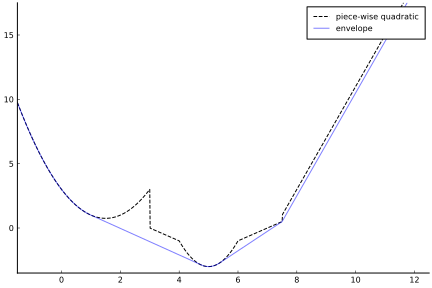

# PiecewiseQuadratics.jl

[](https://github.com/JuliaFirstOrder/PiecewiseQuadratics.jl/actions?query=workflow%3ACI+branch%3Amain)
[](https://codecov.io/gh/JuliaFirstOrder/PiecewiseQuadratics.jl)

[](https://juliafirstorder.github.io/PiecewiseQuadratics.jl/stable)
[](https://juliafirstorder.github.io/PiecewiseQuadratics.jl/dev)

**PiecewiseQuadratics.jl** is a [Julia](http://julialang.org) package for manipulation of univariate piecewise quadratic functions of the form
```
f(x) = p x² + q x + r, ∀ x ∈ [lb, ub]
```
where:
* `p`, `q`, `r` are scalar
* `x` is the decision variable
* `lb` is the lower bound of `x`
* `ub` is the upper bound of `x`


 There is a particular focus on convex analysis and optimization.  The following operations are supported:
- Addition
- Convex envelope
- Proximal operator
- Minimization
- Others, such as scalar multiplication, shifting, perspective transformation.

### Authors
This package and [LCSO.jl](https://github.com/JuliaFirstOrder/LCSO.jl) were originally developed by [Nicholas Moehle](https://www.nicholasmoehle.com/), [Ellis Brown](http://ellisbrown.github.io), and [Mykel Kochenderfer](https://mykel.kochenderfer.com/) at BlackRock AI Labs.  They were developed to produce the results in the following paper: [arXiv:2103.05455](https://arxiv.org/abs/2103.05455).

## Contents
- [Installation](#installation)
- [Example](#example)
- [Contribute](#contribute)

## Installation
Use Julia's builtin package manager [Pkg](https://docs.julialang.org/en/v1/stdlib/Pkg/) to install.
From a Julia REPL:
```Julia
] add PiecewiseQuadratics
```

## Example

### Bounded Quadratics
 We specify a bounded quadratic `g(x) = x² + 2x + 4, ∀x ∈ [0,5]` by
```julia
# (lb, ub, p, q, r)
g = BoundedQuadratic(0, 5, 1, 2, 4)
```

### Piecewise Quadratics
We specify a piecewise quadratic function by providing a list of bounded quadratics in order. Where the pieces overlap, we take the function value to be the minimum over all possible values.

We specify


as follows:

```julia
f = PiecewiseQuadratic([
  BoundedQuadratic(-Inf, 3.0, 1.0, -3.0, 3.0),
  BoundedQuadratic(3.0, 4.0, 0.0, -1.0, 3.0),
  BoundedQuadratic(4.0, 6.0, 2.0, -20.0, 47.0),
  BoundedQuadratic(6.0, 7.5, 0.0, 1.0, -7.0),
  BoundedQuadratic(7.5, Inf, 0.0, 4.0, -29.0)
])
```

### Plot

Below is a plot of the above piece-wise quadratic and its convex envelope, and the code to generate it.
```julia
using Plots
plot(get_plot(f); grid=false, linestyle=:dash, color=:black, label="piece-wise quadratic")
plot!(get_plot(simplify(envelope(f))); color=:blue, la=0.5, label="envelope")

```




## Contribute
Pull requests are welcome. For major changes, please open an issue first to discuss what you would like to change.

Please make sure to update tests as appropriate.  See `CONTRIBUTING.md` for more detail.
